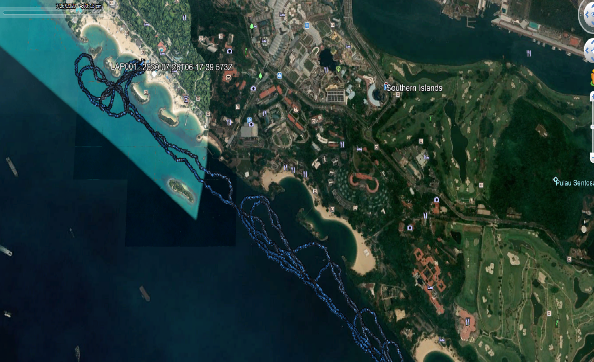
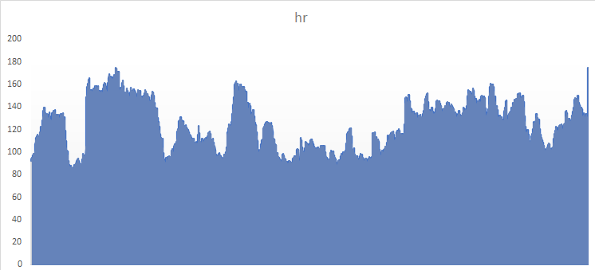
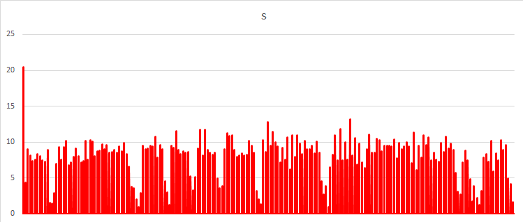

# Tracking Visualisation: DIY

## External references

- [On Liberating My Smartwatch From Cloud Services](https://www.bunniestudios.com/blog/?p=5863)
- [GPS Label](https://www.gpsbabel.org/)
- [Quantified-Self](https://github.com/jimmykane/quantified-self/)

## .tcx file in Google Earth

## .tcx to .csv
I am using the Google Fit data taken from [Google Takeout](https://takeout.google.com/).
Converter is [TCX2CSV](./src/main/java/tj/gfit/TCX2CSV.java), data class is [TrackPoint](./src/main/java/tj/gfit/TrackPoint.java).
(For some reason, I had to calculate the speed as the data was not explicitly present)

## csv verification via XL
### Heart Rate

### Speed

## Plot on map via Folium
See this [Jupyter Notebook](./gviz.ipynb) and the resulting [map](./gviz.html) using [Folium](https://python-visualization.github.io/folium/)